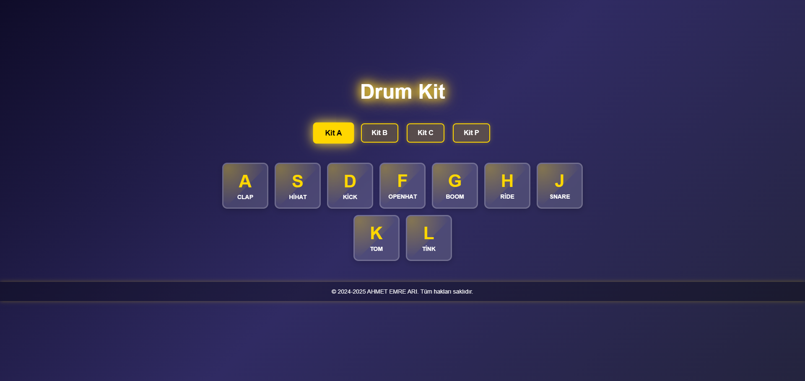

# 

# 🥁 Drum Kit (Davul Seti)

## 🎶 Hakkında (About)
Bu proje, klavyeniz veya farenizle davul çalmanıza olanak tanıyan **modern ve şık bir Drum Kit** uygulamasıdır.
Kullanıcılar farklı davul kitleri arasında geçiş yapabilir, neon efektli tuşlar ile **gerçekçi bir davul deneyimi** yaşayabilir.

This project allows you to play drums using your keyboard or mouse. Users can switch between different drum kits and experience **a realistic drumming experience with neon-lit keys**.

---

## 🚀 Özellikler (Features)
✅ **Klavyeyle ve fareyle oynama** *(Play with keyboard & mouse)*  
✅ **Neon & Glassmorphism Efektleri** *(Neon & Glassmorphism Effects)*  
✅ **4 Farklı Davul Seti** *(4 Different Drum Kits: Kit A, Kit B, Kit C, Kit P)*  
✅ **Duyarlı & Mobil Uyumlu** *(Responsive & Mobile Compatible)*  
✅ **Animasyonlu Tuş Basma Efekti** *(Animated Key Press Effect)*  
✅ **MIDI desteği (Gelecekte!)** *(MIDI Support - Coming Soon!)*  

---

## 📸 Önizleme (Preview)


---

## 📂 Kurulum (Installation)

```bash
# 1️⃣ Depoyu klonlayın *(Clone the repository)*
git clone https://github.com/ahmetemreari/jsdrumkit.git

# 2️⃣ Klasöre gidin *(Go to the folder)*
cd drum-kit

# 3️⃣ Canlı önizleme için bir sunucu başlatın *(Start a live server for preview)*
# Örneğin, Python ile: (For example, using Python)
python -m http.server 8080
```
Şimdi tarayıcınızda **http://localhost:8080** adresine giderek uygulamayı kullanabilirsiniz.  
Now, open your browser and go to **http://localhost:8080** to use the application.

---

## 🎮 Kullanım (Usage)
1️⃣ Klavyenizde **A - S - D - F - G - H - J - K - L** tuşlarına basarak davul çalın.  
   *(Press **A - S - D - F - G - H - J - K - L** keys to play drum sounds.)*  
2️⃣ Farenizle davul tuşlarına tıklayarak çalabilirsiniz.  
   *(Click the drum keys with your mouse.)*  
3️⃣ **Kit Seçme Butonları** ile farklı davul seslerine geçiş yapın.  
   *(Use "Kit Selector" buttons to switch between different drum sounds.)*  

---

## 📜 Lisans (License)
Bu proje **MIT Lisansı** ile lisanslanmıştır.  
This project is licensed under the **MIT License**.

---

## 📞 İletişim (Contact)
👑 **Geliştirici / Developer:** Ahmet Emre Arı  
🌍 **Web Site:** [aemreari.com](https://www.aemreari.com.tr)  
📩 **E-Posta / Email:** info@aemreari.com.tr  
🚀 **GitHub:** [github.com/aemreari](https://github.com/ahmetemreari)  

---

